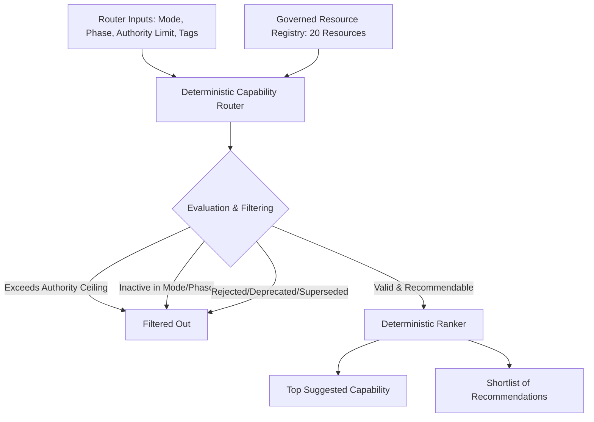

# Creative OS Slice 3A — Governed Integration Architecture

This document summarizes the Governed Integration Architecture for Slice 3A in `/creative-os`.

---

## Governed Integration Strategy

The Creative Operating System introduces a resource-governed integration layer. This layer ensures that any third-party external tools (Providers, Pipelines, Skills) or internal methodologies are evaluated and activated according to strictly enforced security bounds, phase constraints, and authority limits.

---

## Core Security & Progressive Loading Constraints

Slice 3A defines a progressive loading paradigm to secure local execution:
* **LEVEL_0_METADATA**: General identification, modes, type, and license details.
* **LEVEL_1_CAPABILITY_CARD**: Associated capability actions, artifact types, and target gaps.
* **LEVEL_2_OPERATIONAL_INSTRUCTIONS**: Local implementation scripts or commands. (Strictly inaccessible at runtime)
* **LEVEL_3_PROVIDER_MANIFEST**: Private tokens, configuration, and endpoint definitions. (Strictly inaccessible at runtime)

Under Slice 3A, the runtime only accesses **LEVEL_0** and **LEVEL_1** data. Any request attempting to access or parse Level 2/3 parameters is automatically blocked at the module boundary.
