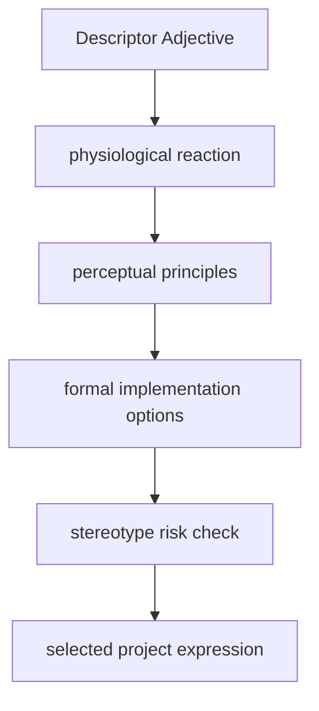

# Somatic Response-To-Form Traceability Spec

This document describes the decoupled somatic reasoning chain implemented in Somatic Response Design V3.

---

## 1. Traceability Reasoning Chain

## 2. Perceptual Principles Definitions

### A. Slow Viewing / Meditative Reading
* **Principle**: Reduced competing focal events
* **Justification**: Limiting concurrent visual demands allows longer information dwell.

### B. Immediate Gaze Capture
* **Principle**: Isolated visual anomaly / High structural contrast
* **Justification**: An off-grid element breaks expectations and forces instant saccadic capture.

### C. Engagement / Forward Lean
* **Principle**: Unresolved visual question
* **Justification**: Compacting the space between visual triggers and payoffs induces investigative behavior.

### D. Playful Smile
* **Principle**: Controlled expectation violation
* **Justification**: Juxtaposing familiar setups with unexpected details triggers relaxed smiles.
