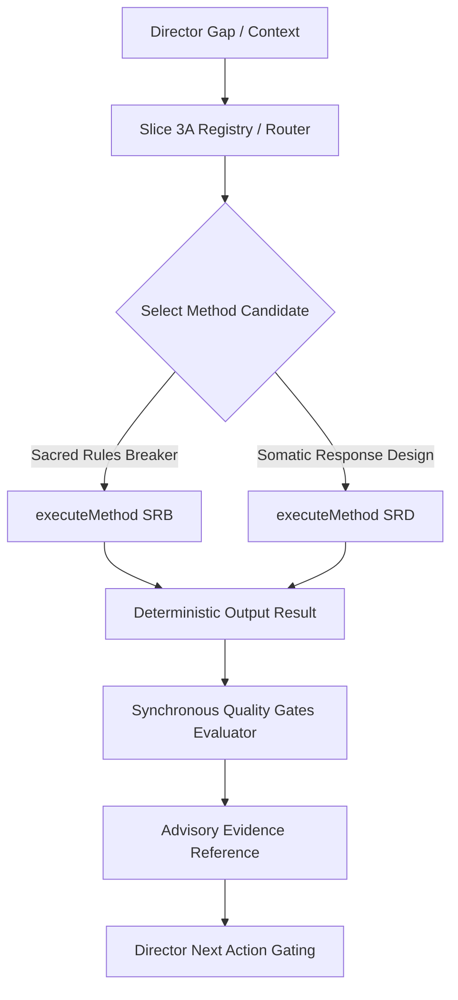

# Architecture Summary — Creative Method Runtime

## Overview
Slice 3B introduces the **Creative Method Runtime**, a local, deterministic, provider-free execution engine that converts abstract creative methods into structured, testable reasoning outputs.

## Architectural Decoupling Rules
1. **Advisory Gating Only**: Methods act exclusively as read-only advisory inputs. They generate `advisoryEvidence` strings which appear in the UI and test suites to verify quality, but never trigger external state mutations.
2. **Deterministic & Local**: Every method run uses pure synchronous code (no promises, no network fetches, no timers, no random number generators, no clocks).
3. **Fail-Closed Execution**: Incompatible modes instantly return a status of `BLOCKED` with empty outputs and zero passing gates.
4. **Project Brain Isolation**: Execution does not touch the canonical `ProjectBrain` state database. Outputs are derived functionally from inputs.
